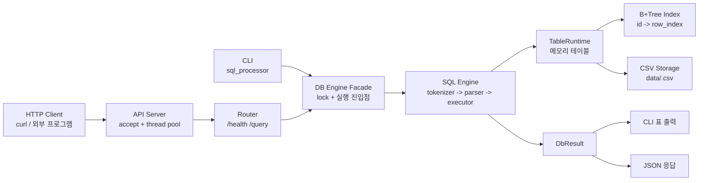
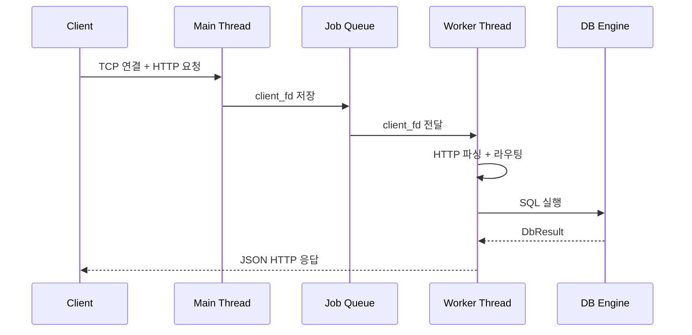
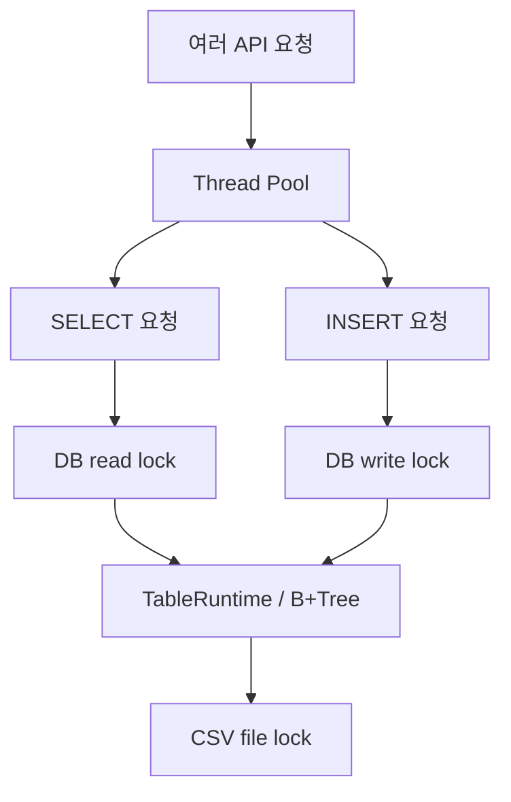
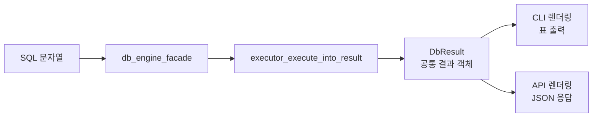
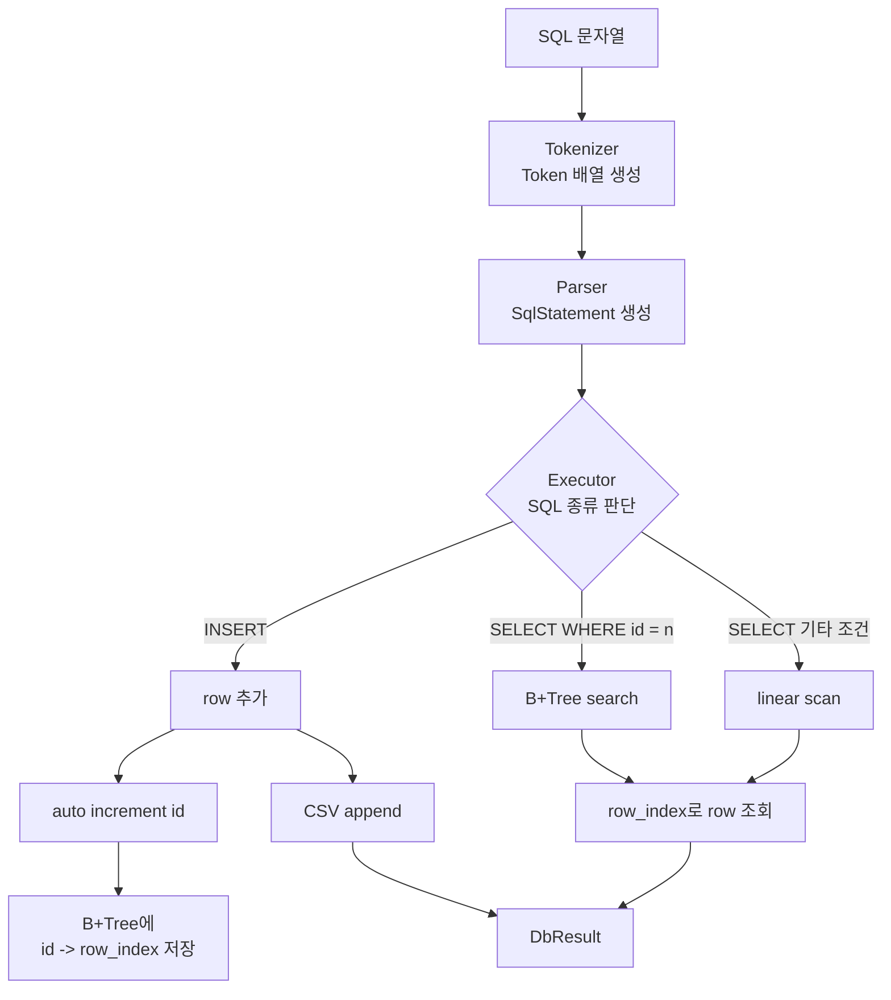
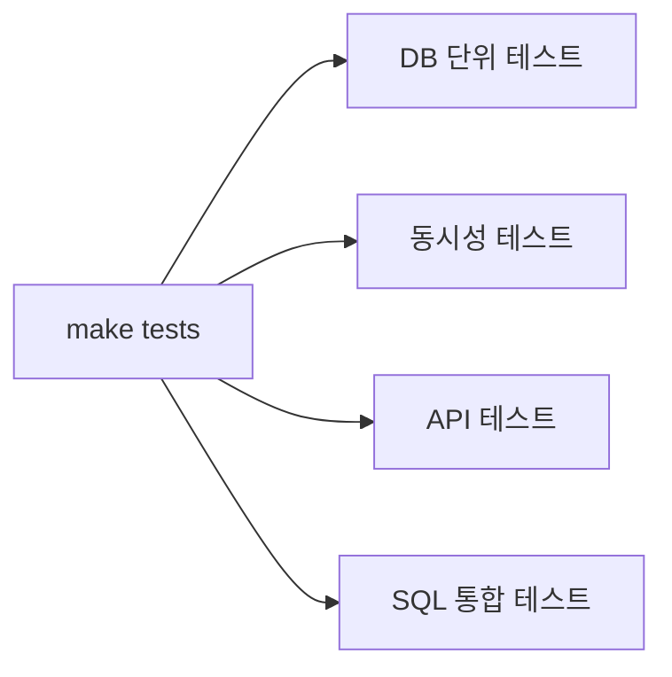

# Mini DBMS API Server 발표 자료

## 0. 오늘 발표의 핵심

**기존 C 기반 SQL 처리기와 B+Tree 인덱스를 재사용해, 외부 클라이언트가 HTTP API로 SQL을 실행할 수 있는 멀티스레드 미니 DBMS 서버를 구현했습니다.**

이번 과제의 중점 포인트는 세 가지입니다.

| 중점 포인트 | 우리 프로젝트에서 다룬 방식 |
| --- | --- |
| API 서버 아키텍처 | socket 서버, router, JSON 응답 생성 |
| DB 엔진 연결 설계 | `db_engine_facade`와 `DbResult`로 API 서버와 SQL 엔진 분리 |
| 멀티스레드 동시성 | thread pool, job queue, rwlock, mutex, file lock 적용 |

## 1. 4분 발표 순서

| 시간 | 주제 | 한 문장 요약 |
| --- | --- | --- |
| 0:00 - 0:30 | 목표 | SQL 처리기를 외부 API로 사용할 수 있게 확장했습니다. |
| 0:30 - 1:10 | 전체 구조 | CLI와 API는 입구만 다르고 같은 DB 엔진을 공유합니다. |
| 1:10 - 2:00 | API 서버 | accept loop와 worker thread를 분리했습니다. |
| 2:00 - 2:50 | 동시성 | 공유 DB 상태를 lock으로 보호했습니다. |
| 2:50 - 3:30 | DB 엔진 연결 | 실행 결과를 `DbResult`로 구조화했습니다. |
| 3:30 - 4:00 | 검증 | 단위 테스트와 API 동시 요청 테스트로 확인했습니다. |

## 2. 전체 아키텍처

발표에서는 이 그림 하나로 전체 구조를 먼저 설명하면 됩니다.



발표 멘트:

> 이 프로젝트는 CLI와 API 서버라는 두 입구를 가집니다. CLI는 터미널에서 SQL을 실행하고, API 서버는 HTTP 요청으로 SQL을 받습니다. 둘 다 최종적으로 `db_engine_facade`를 통해 같은 SQL 엔진을 사용합니다.

핵심만 기억하면 됩니다.

```text
입력 -> db_engine_facade -> tokenizer/parser/executor -> TableRuntime/B+Tree/CSV -> DbResult -> 출력
```

## 3. API 서버 요청 처리 흐름

API 서버는 main thread가 요청을 모두 처리하지 않습니다.
main thread는 연결을 받고, worker thread가 실제 요청을 처리합니다.



구현 위치:

| 파일 | 역할 |
| --- | --- |
| `src/api/api_server.c` | socket, accept loop, request read/write |
| `src/api/request_router.c` | `/health`, `/query` 분기 |
| `src/api/response_builder.c` | JSON body와 HTTP 응답 생성 |
| `src/concurrency/thread_pool.c` | worker thread 관리 |
| `src/concurrency/job_queue.c` | 요청 queue 관리 |

발표 멘트:

> 요청이 들어올 때마다 thread를 새로 만들지 않고, 미리 만들어 둔 worker thread들이 queue에서 일을 가져가 처리합니다. queue가 꽉 차면 503을 반환해 서버 자원을 보호합니다.

## 4. 멀티스레드 동시성 설계

멀티스레드에서 위험한 부분은 **공유 상태**입니다.
이 프로젝트에서는 DB 내부 상태와 cache, 파일을 각각 다른 방식으로 보호했습니다.



| 공유 자원 | 발생 가능한 문제 | 해결 |
| --- | --- | --- |
| `next_id` | 동시 INSERT 시 id 중복 | write lock |
| `TableRuntime.rows` | 배열 변경 중 충돌 | write lock |
| B+Tree | 삽입 중 tree 구조 변경 | write lock |
| SELECT | 읽기끼리는 병렬 가능 | read lock |
| tokenizer cache | 전역 cache list 변경 | mutex |
| CSV 파일 | 동시에 파일 읽기/쓰기 | `flock` |

현재 정책:

```text
SELECT -> read lock
INSERT -> write lock
tokenizer cache -> 별도 mutex
CSV 파일 -> flock
```

발표 멘트:

> SELECT는 read lock으로 병렬 조회가 가능하게 했고, INSERT는 `next_id`, rows, B+Tree를 바꾸기 때문에 write lock으로 직렬화했습니다.

## 5. API 서버와 DB 엔진 연결

기존 SQL 처리기는 CLI 출력 중심이었습니다.
API 서버에서는 출력 문자열보다 **구조화된 실행 결과**가 필요했습니다.

그래서 `DbResult`를 중심으로 CLI와 API 출력을 분리했습니다.



`DbResult`에 담기는 정보:

- 성공 여부
- INSERT / SELECT / ERROR 타입
- 메시지
- SELECT 컬럼과 rows
- 영향받은 row 수
- B+Tree 사용 여부: `used_id_index`

발표 멘트:

> executor가 바로 출력하지 않고 `DbResult`를 반환하게 만들었습니다. 덕분에 같은 SQL 실행 결과를 CLI는 표로, API는 JSON으로 바꿀 수 있습니다.

## 6. SQL 실행과 B+Tree 인덱스

SQL은 다음 순서로 처리됩니다.



B+Tree 사용 조건:

```sql
SELECT id, name FROM users WHERE id = 1;
```

이 경우 전체 row를 훑지 않고 `bptree_search`로 바로 찾습니다.
API 응답의 `"used_id_index": true`로 실제 인덱스 사용 여부를 확인할 수 있습니다.

## 7. 데모 명령어

서버 실행:

```bash
make
./api_server 8080 4 16
```

상태 확인:

```bash
curl -i http://127.0.0.1:8080/health
```

INSERT:

```bash
curl -i -X POST http://127.0.0.1:8080/query \
  -H "Content-Type: application/json" \
  --data '{"sql":"INSERT INTO demo_users (name, age) VALUES ('\''Alice'\'', 30);"}'
```

B+Tree 인덱스 SELECT:

```bash
curl -i -X POST http://127.0.0.1:8080/query \
  -H "Content-Type: application/json" \
  --data '{"sql":"SELECT id, name FROM demo_users WHERE id = 1;"}'
```

응답에서 볼 포인트:

```json
{
  "ok": true,
  "type": "select",
  "used_id_index": true,
  "row_count": 1
}
```

## 8. 테스트와 검증



검증 내용:

| 테스트 | 확인한 것 |
| --- | --- |
| DB 단위 테스트 | tokenizer, parser, executor, B+Tree |
| 동시성 테스트 | thread pool, tokenizer cache |
| API smoke test | `/health`, INSERT, SELECT |
| API 동시 요청 테스트 | 동시 INSERT, 병렬 SELECT |
| SQL 통합 테스트 | `.sql` 파일 실행 결과 |

실행:

```bash
make tests
```

발표 멘트:

> 빠르게 구현하는 것뿐 아니라, 단위 테스트와 실제 API 서버 테스트를 통해 요구사항이 동작하는지 검증했습니다.

## 9. 한계와 개선 방향

현재 한계:

- 메모리 runtime은 활성 table 하나만 유지합니다.
- DELETE는 parser/storage 일부 구현은 있지만 executor에서는 미지원입니다.
- HTTP/JSON parser는 과제 MVP 수준입니다.
- transaction, JOIN, 인증, TLS는 지원하지 않습니다.

개선 방향:

- 여러 table을 동시에 유지하는 table registry
- table별 lock으로 병렬성 향상
- DELETE 지원 시 B+Tree와 row index 재구성
- column별 secondary index
- production 수준 JSON parser 적용

## 10. 4분 발표 대본

### 0:00 - 0:30 프로젝트 소개

> 이번 프로젝트는 기존 C 기반 SQL 처리기와 B+Tree 인덱스를 활용해, 외부 클라이언트가 HTTP API로 SQL을 실행할 수 있는 미니 DBMS API 서버를 만든 것입니다.

### 0:30 - 1:10 전체 구조

> 전체 구조는 CLI/API 진입점, API 서버, 공통 DB 엔진, 데이터 계층으로 나눌 수 있습니다. CLI와 API는 입력 방식만 다르고, 둘 다 `db_engine_facade`를 통해 같은 DB 엔진을 사용합니다.

### 1:10 - 2:00 API 서버 구조

> API 서버는 main thread가 연결을 accept하고, 실제 요청 처리는 worker thread가 담당합니다. 요청은 bounded job queue를 통해 전달되고, `/health`와 `/query`는 router에서 분기됩니다.

### 2:00 - 2:50 동시성 처리

> 멀티스레드 환경에서 `next_id`, rows 배열, B+Tree, tokenizer cache, CSV 파일이 공유 자원입니다. SELECT는 read lock, INSERT는 write lock으로 처리했고, tokenizer cache는 mutex, CSV는 file lock으로 보호했습니다.

### 2:50 - 3:30 DB 엔진 연결

> 기존 executor는 CLI 출력 중심이었지만 API 서버는 JSON 응답이 필요했습니다. 그래서 `DbResult`를 만들어 SQL 실행 결과를 구조화했고, CLI는 표로, API는 JSON으로 렌더링하도록 분리했습니다.

### 3:30 - 4:00 검증

> `make tests`로 DB 단위 테스트, thread pool 테스트, API smoke test, 동시 INSERT와 병렬 SELECT 테스트를 수행했습니다. 특히 `WHERE id = ?` 조회는 응답의 `used_id_index`로 B+Tree 사용 여부를 확인할 수 있습니다.

## 11. QnA 빠른 답변

**Q. 가장 중요한 설계 포인트는?**

A. API 서버와 SQL 엔진을 `db_engine_facade`와 `DbResult`로 분리한 점입니다.

**Q. race condition은 어떻게 막았나요?**

A. INSERT는 write lock, SELECT는 read lock을 사용했습니다. tokenizer cache는 mutex, CSV 파일은 `flock`으로 보호했습니다.

**Q. B+Tree는 어디에 쓰이나요?**

A. `id -> row_index` 인덱스로 사용하고, `SELECT ... WHERE id = 정수`에서 빠르게 row를 찾습니다.

**Q. queue가 꽉 차면 어떻게 하나요?**

A. 대기하지 않고 `503 Server is busy`를 반환합니다.

**Q. DELETE는 왜 미지원인가요?**

A. DELETE를 완전히 지원하려면 메모리 rows, row index, B+Tree, CSV를 모두 일관되게 갱신해야 해서 이번 핵심 범위에서는 명확히 미지원 처리했습니다.

