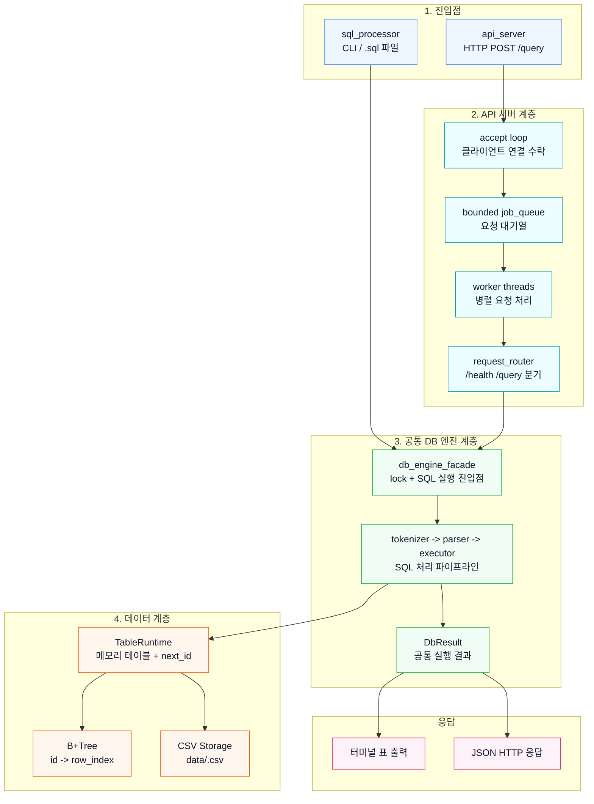
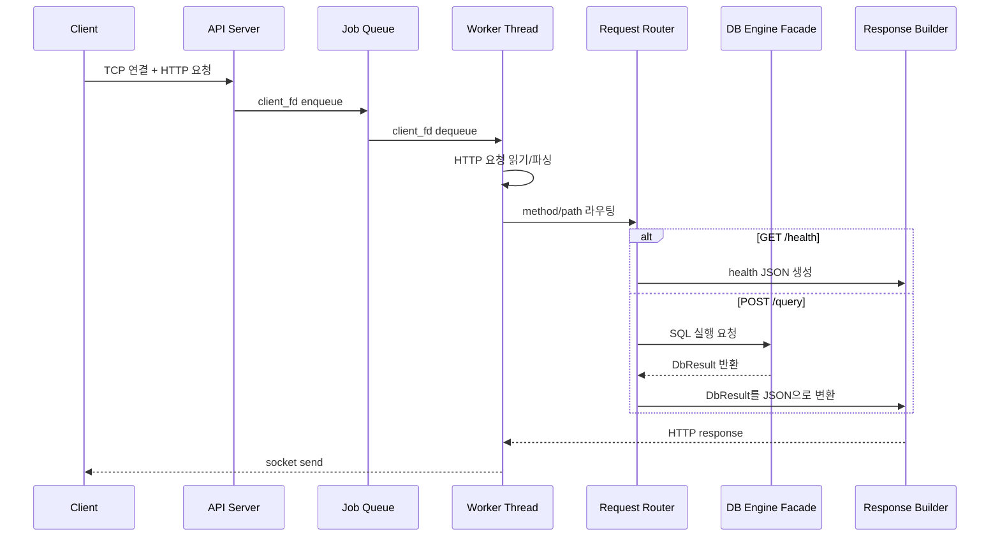
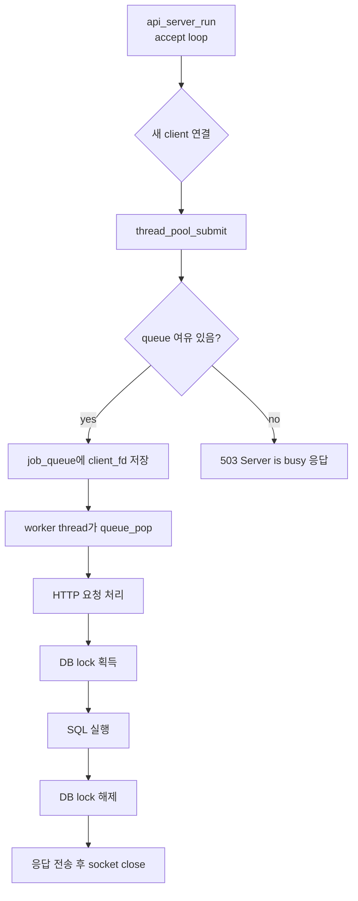
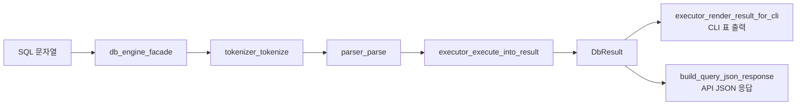
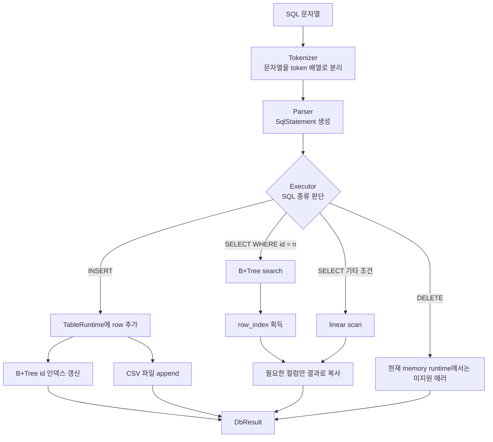
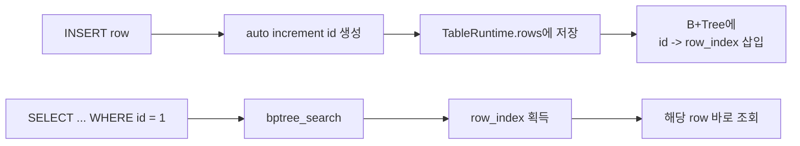
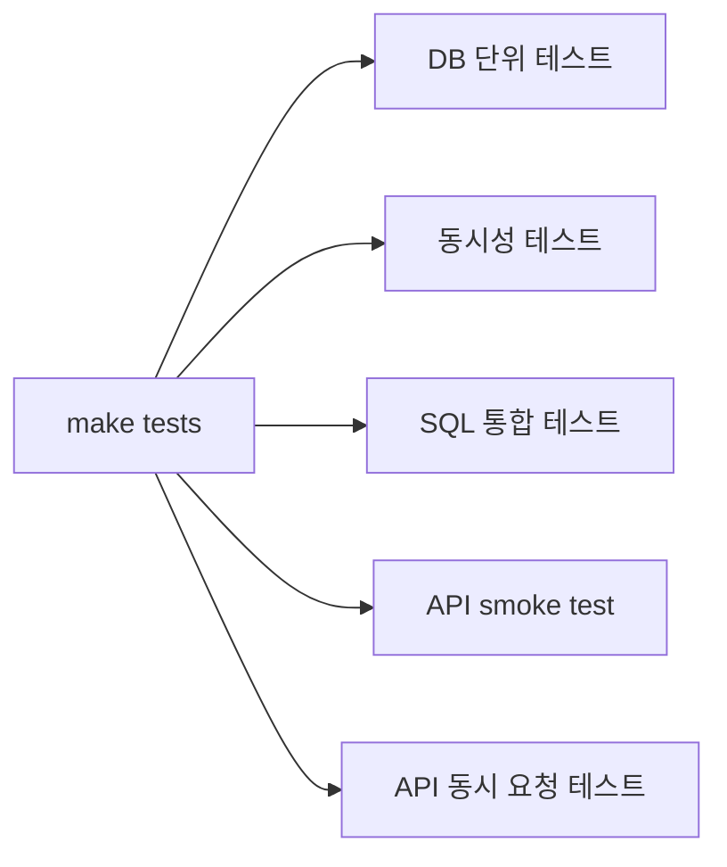

# Mini DBMS API Server 4분 발표 자료

## 0. 발표 핵심 한 문장

이번 프로젝트는 **기존 C 기반 SQL 처리기와 B+Tree 인덱스를 재사용해, 외부 클라이언트가 HTTP API로 SQL을 실행할 수 있는 멀티스레드 미니 DBMS 서버**를 구현한 것입니다.

## 0-1. 4분 발표 흐름
발표에서 강조할 세 가지는 다음입니다.

- **API 서버 아키텍처**: socket 기반 HTTP 서버, router, JSON response
- **DB 엔진 연결 설계**: API 서버와 기존 SQL 엔진 사이를 `db_engine_facade`와 `DbResult`로 분리
- **멀티스레드 동시성 제어**: thread pool, bounded job queue, DB rwlock, tokenizer cache mutex, file lock
| 시간 | 설명할 내용 | 핵심 문장 |
| --- | --- | --- |
| 0:00 - 0:30 | 프로젝트 목표 | 기존 SQL 처리기를 외부에서 호출 가능한 API 서버로 확장했습니다. |
| 0:30 - 1:15 | 전체 아키텍처 | CLI와 API는 입력 방식만 다르고 같은 DB 엔진을 공유합니다. |
| 1:15 - 2:00 | API 서버 구조 | accept loop, job queue, worker thread, router, response builder로 나눴습니다. |
| 2:00 - 2:45 | 동시성 이슈 | 공유 DB 상태는 rwlock, tokenizer cache는 mutex, CSV는 file lock으로 보호했습니다. |
| 2:45 - 3:30 | DB 엔진 연결 | `DbResult`로 실행 결과를 구조화해 CLI 출력과 API JSON 응답을 분리했습니다. |
| 3:30 - 4:00 | 검증과 데모 | 단위 테스트, API smoke test, 동시 요청 테스트로 검증했습니다. |

## 1. 전체 아키텍처

발표에서는 아래 다이어그램처럼 **4개 계층**으로 설명하면 가장 깔끔합니다.

- 진입점: CLI 또는 HTTP API
- API 서버 계층: 연결 수락, queue, worker thread, router
- 공통 DB 엔진 계층: SQL 실행 파이프라인
- 데이터 계층: 메모리 테이블, B+Tree, CSV 저장소



발표 설명:

> 전체 구조는 네 계층으로 나눠 볼 수 있습니다. CLI와 API 서버는 진입점만 다르고, SQL 실행은 모두 `db_engine_facade`를 통해 공통 DB 엔진으로 들어갑니다. API 서버는 accept loop, job queue, worker thread, router로 요청을 병렬 처리하고, DB 엔진은 tokenizer, parser, executor를 거쳐 `TableRuntime`, B+Tree, CSV storage를 사용합니다. 마지막에는 같은 `DbResult`를 CLI는 표로, API는 JSON으로 변환합니다.

## 2. API 서버 아키텍처



발표 설명:

> main thread는 클라이언트 연결을 `accept`한 뒤 직접 SQL을 처리하지 않고 queue에 넣습니다. 실제 요청 처리는 worker thread가 담당합니다. 이렇게 accept와 처리 로직을 분리해서 여러 요청을 병렬로 처리할 수 있게 했습니다.

구현 파일:

- `src/api/api_main.c`: API 서버 실행 인자 파싱
- `src/api/api_server.c`: socket, accept loop, request read/write
- `src/api/http_parser.c`: raw HTTP request 파싱
- `src/api/request_router.c`: `/health`, `/query` 라우팅
- `src/api/response_builder.c`: JSON body와 HTTP response 생성

## 3. Thread Pool과 동시성 처리



발표 설명:

> 요청마다 thread를 새로 만들지 않고, 미리 worker thread를 만들어 둔 thread pool 구조를 사용했습니다. queue가 꽉 차면 무한 대기하지 않고 503을 반환해서 서버가 과부하 상태에서도 자원을 보호하도록 했습니다.

동시성 보호 지점:

| 공유 자원 | 위험 | 보호 방식 |
| --- | --- | --- |
| `TableRuntime.rows` | 동시 INSERT 시 배열 손상 가능 | DB write lock |
| `next_id` | 동시 INSERT 시 중복 id 가능 | DB write lock |
| B+Tree root/node | 삽입 중 tree 구조 변경 | DB write lock |
| SELECT | 여러 read 동시 처리 가능 | DB read lock |
| tokenizer cache | 전역 linked list cache 변경 | tokenizer cache mutex |
| CSV 파일 | 여러 thread/process 접근 | `flock` file lock |

현재 lock 정책:

```text
SELECT -> read lock
INSERT/DELETE -> write lock
아직 로드되지 않은 table SELECT -> write lock으로 승격
```

발표에서 강조할 말:

> SELECT는 읽기 작업이라 동시에 실행될 수 있게 read lock을 사용했습니다. 반면 INSERT는 `next_id`, rows 배열, B+Tree를 변경하므로 write lock으로 직렬화했습니다.

## 4. 내부 DB 엔진과 API 서버 연결 설계

기존 SQL 처리기는 CLI 출력 중심이었습니다.
API 서버에서는 stdout 출력이 아니라 JSON 응답이 필요했기 때문에 실행 결과를 구조화하는 계층을 추가했습니다.



핵심 설계:

- `db_engine_facade`: API 서버가 DB 내부 구현을 직접 알지 않게 하는 진입점
- `DbResult`: SQL 실행 결과를 구조화한 공통 결과 객체
- CLI/API 출력 분리: 같은 실행 결과를 CLI는 표로, API는 JSON으로 변환

`DbResult` 주요 정보:

- 성공 여부
- INSERT/SELECT/ERROR 타입
- 메시지
- SELECT 컬럼과 rows
- 영향받은 row 수
- B+Tree 인덱스 사용 여부: `used_id_index`

발표에서 강조할 말:

> API 서버가 executor 내부를 직접 호출하고 출력 문자열을 긁어오는 방식이 아니라, `DbResult`라는 결과 객체를 중심으로 CLI와 API를 분리했습니다. 이 부분이 기존 SQL 처리기를 API 서버로 확장하기 위한 핵심 연결 설계입니다.

## 5. SQL 실행 흐름



발표 설명:

> SQL 문자열은 token 배열로 나뉘고, parser가 `SqlStatement` 구조체로 바꿉니다. executor는 SQL 종류에 따라 INSERT와 SELECT를 처리합니다. 특히 `WHERE id = 정수` 조건은 B+Tree를 사용하고, 그 외 조건은 선형 탐색을 사용합니다.

## 6. B+Tree 인덱스 활용



핵심 설명:

- `id`는 자동 증가 primary key처럼 사용합니다.
- B+Tree에는 실제 row 전체가 아니라 `id -> row_index`를 저장합니다.
- `SELECT ... WHERE id = ?`는 전체 row를 훑지 않고 B+Tree로 바로 찾습니다.
- API 응답에 `"used_id_index": true`를 넣어 인덱스 사용 여부를 확인할 수 있습니다.

예시 응답:

```json
{
  "ok": true,
  "type": "select",
  "used_id_index": true,
  "row_count": 1,
  "columns": ["id", "name"],
  "rows": [["1", "Alice"]]
}
```

## 7. API 예시

서버 실행:

```bash
make
./api_server 8080 4 16
```

health check:

```bash
curl -i http://127.0.0.1:8080/health
```

INSERT:

```bash
curl -i -X POST http://127.0.0.1:8080/query \
  -H "Content-Type: application/json" \
  --data '{"sql":"INSERT INTO demo_users (name, age) VALUES ('\''Alice'\'', 30);"}'
```

B+Tree 인덱스 SELECT:

```bash
curl -i -X POST http://127.0.0.1:8080/query \
  -H "Content-Type: application/json" \
  --data '{"sql":"SELECT id, name FROM demo_users WHERE id = 1;"}'
```

## 8. 테스트와 품질 검증



검증한 내용:

- tokenizer/parser/executor 단위 테스트
- B+Tree insert/search/split 테스트
- DB facade가 SQL 문자열을 `DbResult`로 바꾸는지 테스트
- thread pool과 job queue 동작 테스트
- tokenizer cache thread-safety 테스트
- API `/health`, `/query` smoke test
- 동시 INSERT 요청 후 row count 검증
- 병렬 SELECT 요청 후 일관된 결과 검증

실행 명령어:

```bash
make tests
```

개별 API 테스트:

```bash
bash tests/api/test_api_smoke.sh
bash tests/api/test_api_concurrency_smoke.sh
bash tests/api/test_api_parallel_select_smoke.sh
```

발표에서 강조할 말:

> AI를 활용해 빠르게 구현하는 것뿐 아니라, 단위 테스트와 API smoke test, 동시 요청 테스트를 통해 실제 요구사항이 동작하는지 검증했습니다.

## 9. 한계와 개선 방향

현재 한계:

- table runtime은 전역 활성 table 하나만 유지합니다.
- DELETE는 parser/storage 일부 구현은 있지만 executor memory runtime에서는 미지원입니다.
- JSON parser와 HTTP parser는 과제 MVP 수준입니다.
- transaction, JOIN, 인증, TLS는 지원하지 않습니다.

개선 방향:

- table registry를 만들어 여러 table을 동시에 메모리에 유지
- table별 lock으로 병렬성 향상
- DELETE 지원 시 B+Tree와 row index 재구성
- column별 secondary index 추가
- production 수준 JSON parser 도입

## 10. 4분 발표 대본

### 0:00 - 0:30 프로젝트 소개

> 저희 프로젝트는 기존에 구현한 C 기반 SQL 처리기와 B+Tree 인덱스를 활용해서, 외부 클라이언트가 HTTP API로 SQL을 실행할 수 있는 미니 DBMS API 서버를 만든 것입니다. 핵심 요구사항인 API 서버, thread pool 기반 병렬 처리, 내부 DB 엔진 연결을 중심으로 구현했습니다.

### 0:30 - 1:15 전체 구조

> 전체 구조는 입력 계층, 연결 계층, DB 엔진, 데이터 계층으로 나눴습니다. CLI와 API 서버는 입력 방식만 다릅니다. CLI는 터미널이나 SQL 파일에서 입력을 받고, API 서버는 HTTP POST 요청에서 SQL을 받습니다. 이후에는 둘 다 `db_engine_facade`를 통해 같은 tokenizer, parser, executor 흐름을 사용합니다.

### 1:15 - 2:00 API 서버 구조

> API 서버는 socket 기반으로 구현했습니다. main thread는 client 연결을 accept하고, 처리 작업은 job queue에 넣습니다. worker thread들이 queue에서 client fd를 꺼내 HTTP 요청을 읽고, router가 `/health`와 `/query`를 분기합니다. `/query`에서는 JSON body의 SQL을 꺼내 DB 엔진에 넘기고, 결과를 JSON 응답으로 돌려줍니다.

### 2:00 - 2:45 동시성 처리

> 멀티스레드 환경에서 가장 중요한 공유 자원은 runtime table, auto increment id, B+Tree, tokenizer cache, CSV 파일입니다. INSERT는 rows, next_id, B+Tree를 변경하므로 write lock으로 보호했고, SELECT는 read lock으로 처리해 이미 로드된 table에 대해서는 병렬 조회가 가능하게 했습니다. tokenizer cache는 별도 mutex로 보호하고, CSV 파일 접근은 `flock`을 사용했습니다.

### 2:45 - 3:30 DB 엔진 연결

> 기존 executor는 CLI 출력 중심이었기 때문에 API 응답으로 재사용하기 어려웠습니다. 그래서 `DbResult`라는 구조화된 결과 객체를 만들었습니다. executor는 이제 결과를 바로 출력하지 않고 `DbResult`에 담고, CLI는 이 결과를 표로 출력하고 API는 JSON으로 변환합니다. 이 설계 덕분에 API 서버가 DB 내부 구현에 강하게 의존하지 않도록 분리할 수 있었습니다.

### 3:30 - 4:00 검증과 마무리

> 검증은 `make tests`로 수행했습니다. tokenizer, parser, executor, B+Tree 같은 DB 단위 테스트와 thread pool 동시성 테스트, 그리고 실제 API 서버를 띄워 `/health`, INSERT, SELECT, 동시 INSERT, 병렬 SELECT를 검증하는 smoke test를 작성했습니다. 특히 `WHERE id = ?` 조회는 API 응답의 `used_id_index` 값으로 B+Tree 사용 여부를 확인할 수 있습니다.

## 12. QnA 대비 핵심 답변

**Q. 이번 프로젝트에서 가장 중요한 설계 포인트는?**

A. API 서버와 DB 엔진을 직접 엮지 않고 `db_engine_facade`와 `DbResult`로 분리한 점입니다. 덕분에 CLI와 API가 같은 실행 엔진을 공유하면서도 출력 방식은 각각 다르게 가져갈 수 있습니다.

**Q. 멀티스레드에서 race condition은 어떻게 막았나요?**

A. INSERT처럼 DB 상태를 바꾸는 작업은 write lock, SELECT는 read lock으로 처리했습니다. tokenizer cache는 별도 mutex, CSV 파일은 `flock`으로 보호했습니다.

**Q. B+Tree는 어디에 쓰이나요?**

A. `id -> row_index` 인덱스로 사용합니다. `SELECT ... WHERE id = 정수`에서 `bptree_search`로 row 위치를 바로 찾습니다.

**Q. queue가 꽉 차면 어떻게 하나요?**

A. 기다리지 않고 `503 Server is busy.`를 반환합니다. 서버 자원을 보호하기 위한 backpressure입니다.

**Q. DELETE는 왜 미지원인가요?**

A. DELETE를 완전히 지원하려면 CSV뿐 아니라 memory rows, row_index, B+Tree까지 일관되게 갱신해야 합니다. 이번 과제 핵심은 API 서버, thread pool, 기존 SQL/B+Tree 연결이므로 현재는 명확히 미지원 에러를 반환합니다.
