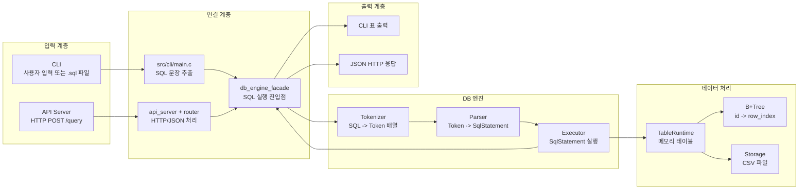
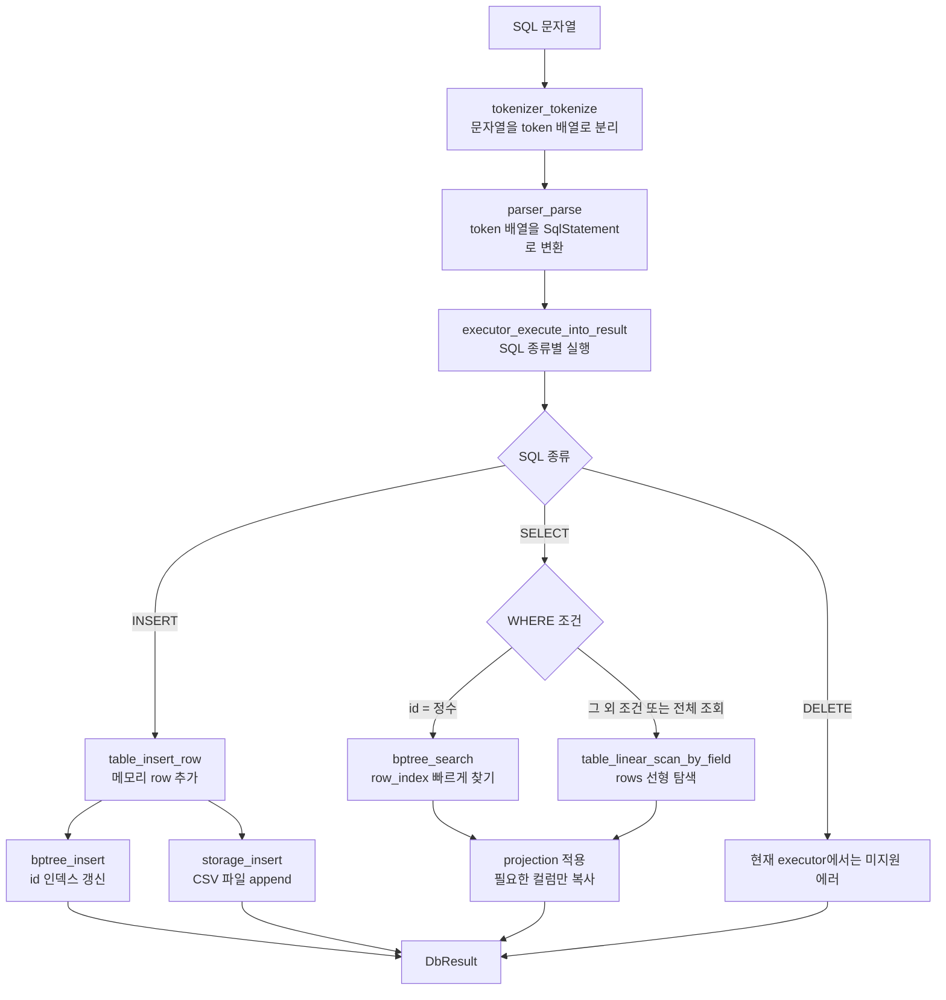
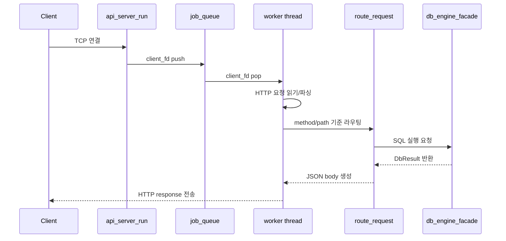

# mini_dbms Study Notes

이 문서는 이 저장소를 공부할 때 전체 흐름을 빠르게 잡기 위한 정리입니다.
핵심은 `SQL 문자열 -> tokenizer -> parser -> executor -> table_runtime/storage/B+Tree -> 결과` 흐름이고, 여기에 CLI와 HTTP API 서버가 각각 진입점으로 붙어 있습니다.

## 1. 프로젝트 한 줄 요약

작은 SQL 처리기를 C99로 구현한 미니 DBMS입니다.

- CLI에서 SQL 파일 또는 REPL 입력을 실행할 수 있습니다.
- HTTP API 서버로 `POST /query` 요청을 받아 SQL을 실행할 수 있습니다.
- 데이터는 `data/<table>.csv`에 저장됩니다.
- 런타임에서는 현재 활성 테이블 하나를 메모리에 올리고, `id -> row_index` B+Tree 인덱스를 유지합니다.
- `SELECT ... WHERE id = ?`는 B+Tree 인덱스를 사용하고, 그 외 조건은 선형 탐색을 사용합니다.
- API 서버는 thread pool과 job queue로 여러 클라이언트 요청을 병렬 처리합니다.

## 2. 폴더 구조

```text
.
|-- Makefile
|-- Dockerfile
|-- README.md
|-- docs/
|   |-- SPEC.md
|   `-- API_SERVER_DESIGN.md
|-- src/
|   |-- cli/
|   |   `-- main.c
|   |-- api/
|   |   |-- api_main.c
|   |   |-- api_server.c/h
|   |   |-- http_parser.c/h
|   |   |-- request_router.c/h
|   |   `-- response_builder.c/h
|   |-- concurrency/
|   |   |-- job_queue.c/h
|   |   |-- thread_pool.c/h
|   |   `-- lock_manager.c/h
|   |-- db/
|   |   |-- tokenizer.c/h
|   |   |-- parser.c/h
|   |   |-- executor.c/h
|   |   |-- executor_result.c/h
|   |   |-- db_engine_facade.c/h
|   |   |-- table_runtime.c/h
|   |   |-- storage.c/h
|   |   |-- bptree.c/h
|   |   |-- index.c/h
|   |   `-- benchmark.c/h
|   `-- common/
|       `-- utils.c/h
`-- tests/
    |-- db/
    |-- concurrency/
    |-- api/
    `-- integration/
```

## 3. 실행 명령어

이 프로젝트는 `gcc`, `make`, `bash`, `pthread`, POSIX socket API를 사용합니다.
Windows에서는 Git Bash, WSL, Docker 같은 POSIX 계열 환경에서 실행하는 편이 안전합니다.

### 빌드

```bash
make
```

빌드 결과:

- `./sql_processor`: CLI SQL 처리기
- `./api_server`: HTTP API 서버
- `build/`: 오브젝트 파일과 테스트 바이너리

### CLI REPL 실행

```bash
./sql_processor
```

예시:

```sql
INSERT INTO users (name, age) VALUES ('Alice', 30);
SELECT * FROM users;
SELECT name FROM users WHERE id = 1;
quit
```

### SQL 파일 실행

```bash
./sql_processor tests/integration/test_cases/basic_select.sql
```

### 벤치마크 실행

```bash
./sql_processor --benchmark
```

기본값은 `1,000,000`개 row 삽입과 `1,000`회 조회입니다.
B+Tree 조회 시간과 선형 탐색 시간을 비교해서 출력합니다.

### API 서버 실행

```bash
./api_server
```

기본 설정:

- port: `8080`
- worker count: `4`
- queue capacity: `16`

인자를 직접 줄 수도 있습니다.

```bash
./api_server 8080 4 16
```

### API 호출 예시

```bash
curl -i http://127.0.0.1:8080/health
```

```bash
curl -i -X POST http://127.0.0.1:8080/query \
  -H "Content-Type: application/json" \
  --data '{"sql":"INSERT INTO users (name, age) VALUES ('\''Alice'\'', 30);"}'
```

```bash
curl -i -X POST http://127.0.0.1:8080/query \
  -H "Content-Type: application/json" \
  --data '{"sql":"SELECT id, name FROM users WHERE id = 1;"}'
```

### 테스트 실행

```bash
make tests
```

`make tests`는 다음을 수행합니다.

- DB 단위 테스트 실행
- 동시성 단위 테스트 실행
- SQL 파일 기반 통합 테스트 실행
- API smoke test 실행
- 동시 INSERT, 병렬 SELECT API 테스트 실행

개별 API 테스트:

```bash
bash tests/api/test_api_smoke.sh
bash tests/api/test_api_concurrency_smoke.sh
bash tests/api/test_api_parallel_select_smoke.sh
```

### 정리

```bash
make clean
```

`build/`, `sql_processor`, `api_server`, `data/*.csv`를 삭제합니다.

### Docker 사용

```bash
docker build -t mini-dbms .
docker run --rm -it -v "$PWD:/app" mini-dbms
make
make tests
```

## 4. 지원 SQL 범위

현재 parser가 구조화해서 받아들이는 문장:

```sql
INSERT INTO users (name, age) VALUES ('Alice', 30);
SELECT * FROM users;
SELECT name, age FROM users WHERE age > 20;
SELECT * FROM users WHERE id = 1;
DELETE FROM users WHERE name = 'Alice';
```

주의할 점:

- `INSERT` 시 `id`는 자동 증가 컬럼으로 붙습니다.
- 메모리 런타임 모드에서는 명시적 `id` 삽입을 거부합니다.
- parser는 `DELETE`를 파싱할 수 있지만, 현재 executor는 `DELETE is not supported in memory runtime mode.`를 반환합니다.
- `WHERE`는 단일 조건만 지원합니다.
- 지원 연산자: `=`, `!=`, `>`, `>=`, `<`, `<=`
- JOIN, transaction, 다중 SQL batch API 실행은 지원하지 않습니다.

## 5. 전체 아키텍처 흐름

이 프로젝트는 진입점이 두 개입니다.

- `sql_processor`: 터미널에서 실행하는 CLI 프로그램
- `api_server`: 외부 클라이언트가 HTTP로 호출하는 API 서버

둘은 시작 방식만 다르고, 실제 SQL 실행은 같은 DB 엔진 흐름을 공유합니다.

### 전체 한 장 요약



### CLI와 API의 차이

| 구분 | CLI | API 서버 |
| --- | --- | --- |
| 실행 파일 | `./sql_processor` | `./api_server` |
| 입력 | 터미널 입력 또는 `.sql` 파일 | HTTP 요청 body의 JSON |
| SQL 전달 | `db_execute_sql` 직접 호출 | `execute_query_with_lock` 호출 |
| 동시성 | 단일 실행 흐름 | thread pool로 병렬 요청 처리 |
| 출력 | 터미널 표와 메시지 | JSON HTTP response |

CLI는 사람이 터미널에서 직접 쓰는 모드입니다.
API 서버는 외부 프로그램이 HTTP로 SQL을 보내는 모드입니다.
하지만 SQL이 DB 엔진 안으로 들어간 뒤에는 둘 다 `tokenizer -> parser -> executor` 흐름을 탑니다.

### DB 엔진 내부 핵심 흐름



### API 서버 병렬 처리 흐름



API 서버에서 중요한 점은 `accept`하는 main thread와 실제 요청을 처리하는 worker thread가 분리되어 있다는 것입니다.
main thread는 연결을 받아 queue에 넣고, worker thread가 queue에서 꺼내 SQL 실행까지 처리합니다.

## 6. 핵심 자료구조

### `Token`

위치: `src/db/tokenizer.h`

```c
typedef struct {
    TokenType type;
    char value[MAX_TOKEN_VALUE];
} Token;
```

SQL 문자열을 keyword, identifier, literal, operator 같은 단위로 나눈 결과입니다.

### `SqlStatement`

위치: `src/db/parser.h`

```c
typedef struct {
    SqlType type;
    union {
        InsertStatement insert;
        SelectStatement select;
        DeleteStatement delete_stmt;
    };
} SqlStatement;
```

parser가 만든 AST에 가까운 구조입니다.
executor는 이 구조만 보고 INSERT/SELECT/DELETE 분기를 탑니다.

### `DbResult`

위치: `src/db/executor_result.h`

SQL 실행 결과를 CLI와 API가 함께 사용할 수 있게 구조화한 결과 객체입니다.

주요 필드:

- `type`: insert/select/delete/error
- `success`: 성공 여부
- `columns`: SELECT 결과 컬럼
- `rows`: SELECT 결과 row 배열
- `row_count`: SELECT 결과 row 수
- `rows_affected`: INSERT 등에서 영향받은 row 수
- `used_id_index`: SELECT가 B+Tree id 인덱스를 썼는지 여부
- `message`: 사용자에게 보여줄 메시지

### `TableRuntime`

위치: `src/db/table_runtime.h`

현재 활성 테이블 하나의 메모리 상태입니다.

주요 필드:

- `table_name`: 현재 로드된 테이블 이름
- `columns`: 컬럼 이름 목록
- `rows`: 메모리에 올라온 row 배열
- `row_count`, `capacity`: row 개수와 동적 배열 용량
- `id_column_index`: id 컬럼 위치
- `next_id`: 다음 auto increment id
- `id_index_root`: B+Tree 루트
- `loaded`: storage에서 로드되었거나 INSERT로 초기화되었는지 여부

중요한 제약:

- 전역적으로 활성 테이블 하나만 유지합니다.
- 다른 테이블을 요청하면 기존 런타임 테이블을 비우고 새 테이블로 갈아탑니다.

### `BPTreeNode`

위치: `src/db/bptree.h`

`id -> row_index` 매핑을 저장하는 B+Tree 노드입니다.

- `is_leaf`: leaf 여부
- `keys`: 정렬된 id key
- `children`: internal node의 child 포인터
- `row_indices`: leaf에서 key에 대응되는 row index
- `parent`: 부모 포인터
- `next`: leaf node 연결 포인터

### `JobQueue`, `ThreadPool`

위치: `src/concurrency/job_queue.h`, `src/concurrency/thread_pool.h`

API 서버에서 accept loop와 worker thread 사이를 연결합니다.
queue가 꽉 차면 blocking하지 않고 즉시 실패해서 API 서버가 `503 Server is busy.`를 반환합니다.

## 7. 모듈별 책임

| 모듈 | 책임 |
| --- | --- |
| `src/cli/main.c` | CLI 진입점, REPL/file/benchmark 모드 분기 |
| `src/api/api_main.c` | API 서버 실행 인자 파싱, DB engine 초기화 |
| `src/api/api_server.c` | socket 생성, accept loop, HTTP read/write, worker 연결 |
| `src/api/http_parser.c` | raw HTTP 요청을 `HttpRequest`로 파싱 |
| `src/api/request_router.c` | method/path에 따라 `/health`, `/query` 처리 |
| `src/api/response_builder.c` | `DbResult`와 에러를 JSON/HTTP 응답으로 직렬화 |
| `src/concurrency/job_queue.c` | bounded queue, mutex/condition variable 기반 push/pop |
| `src/concurrency/thread_pool.c` | worker thread 생성/종료, job 처리 |
| `src/concurrency/lock_manager.c` | DB 실행 구간과 tokenizer cache 보호 |
| `src/db/db_engine_facade.c` | tokenizer/parser/executor를 하나의 DB engine API로 감싸기 |
| `src/db/tokenizer.c` | SQL 문자열을 token 배열로 변환, soft parser cache 관리 |
| `src/db/parser.c` | token 배열을 `SqlStatement`로 변환 |
| `src/db/executor.c` | `SqlStatement` 실행, SELECT 결과 수집, CLI 출력 |
| `src/db/table_runtime.c` | 메모리 테이블, auto id, B+Tree 인덱스, storage 로딩 |
| `src/db/storage.c` | CSV 파일 저장/로드/삭제, file lock, CSV escaping |
| `src/db/bptree.c` | B+Tree 검색/삽입/split/free |
| `src/db/index.c` | CSV offset 기반 equality/range 임시 인덱스 생성 |
| `src/db/benchmark.c` | B+Tree와 선형 탐색 성능 비교 |
| `src/common/utils.c` | 문자열, 파일 읽기, SQL terminator, 출력 폭 계산 공통 유틸 |

## 8. 함수별 역할 정리

아래는 공부할 때 중요한 함수 위주로 정리한 것입니다.
`static` 함수는 파일 내부에서만 쓰이는 helper이고, 헤더에 선언된 함수는 다른 모듈에서도 호출됩니다.

### 8.1 CLI: `src/cli/main.c`

| 함수 | 역할 |
| --- | --- |
| `main` | 프로그램 인자를 보고 REPL/file/benchmark 모드를 선택합니다. DB engine을 초기화하고 종료 시 정리합니다. |
| `main_run_repl_mode` | `SQL>` 프롬프트를 띄우고 세미콜론이 나올 때까지 입력을 누적한 뒤 SQL을 실행합니다. `exit`, `quit`로 종료합니다. |
| `main_run_file_mode` | `.sql` 파일 전체를 읽고 세미콜론 기준으로 문장을 나누어 순서대로 실행합니다. |
| `main_process_sql_statement` | SQL 한 문장을 trim한 뒤 `db_execute_sql`로 실행하고 `executor_render_result_for_cli`로 출력합니다. |
| `main_skip_whitespace` | 파일 모드에서 다음 SQL 시작 위치까지 공백을 건너뜁니다. |
| `main_trimmed_equals` | 입력 줄이 `exit`/`quit` 같은 키워드와 같은지 대소문자 무시 비교합니다. |
| `main_replace_buffer_with_remainder` | REPL 버퍼에서 실행된 SQL 문장을 제거하고 남은 문자열만 유지합니다. |

### 8.2 API 진입점: `src/api/api_main.c`

| 함수 | 역할 |
| --- | --- |
| `main` | API 서버 설정 기본값을 준비하고 인자 `[port] [worker_count] [queue_capacity]`를 파싱합니다. DB engine 초기화 후 `api_server_run`을 호출합니다. |
| `api_main_parse_positive_int` | 포트/worker 수/queue 용량이 양의 정수이고 최대값 범위 안인지 검사합니다. |

### 8.3 API 서버: `src/api/api_server.c`

| 함수 | 역할 |
| --- | --- |
| `api_server_run` | 서버 socket을 열고 thread pool을 만든 뒤 accept loop를 돕니다. 연결이 들어오면 queue에 넣고, queue가 가득 차면 503을 보냅니다. |
| `api_server_create_socket` | `socket -> setsockopt -> bind -> listen` 순서로 TCP 서버 socket을 만듭니다. |
| `api_server_worker_handle_client` | worker thread가 호출하는 handler입니다. 요청을 처리한 뒤 client socket을 닫습니다. |
| `api_server_handle_client` | raw HTTP request 읽기, HTTP 파싱, route 처리, HTTP response 생성/전송을 담당합니다. |
| `api_server_read_http_request` | `recv`로 요청을 읽습니다. header 끝 `\r\n\r\n`과 `Content-Length`를 보고 body까지 읽습니다. |
| `api_server_extract_content_length` | header 문자열에서 `Content-Length` 값을 찾습니다. |
| `api_server_append_bytes` | socket에서 읽은 chunk를 동적 버퍼에 누적합니다. |
| `api_server_send_all` | `send`가 일부만 보낼 수 있으므로 전체 response가 전송될 때까지 반복합니다. |
| `api_server_send_json_error` | 에러 JSON body와 HTTP response를 만들어 client에게 보냅니다. |

### 8.4 HTTP parser: `src/api/http_parser.c`

| 함수 | 역할 |
| --- | --- |
| `parse_http_request` | 첫 줄에서 method/path/protocol을 읽고, `\r\n\r\n` 뒤 문자열을 body로 복사합니다. |
| `http_request_free` | `HttpRequest.body` 동적 메모리를 해제합니다. |

### 8.5 Router: `src/api/request_router.c`

| 함수 | 역할 |
| --- | --- |
| `route_request` | path와 method를 보고 `/health`, `/query`, 404, 405를 분기합니다. |
| `handle_health_request` | `{"status":"ok"}` body와 status 200을 만듭니다. |
| `handle_query_request` | JSON body에서 SQL을 뽑고 `execute_query_with_lock`으로 실행한 뒤 JSON 응답을 만듭니다. |
| `extract_sql_from_json` | 간단한 방식으로 `"sql":"..."` 문자열 필드를 찾고 escape를 처리합니다. 완전한 JSON parser는 아닙니다. |
| `request_router_skip_spaces` | JSON field 주변 공백을 건너뜁니다. |
| `request_router_append_json_char` | SQL 문자열 추출 중 동적 버퍼에 문자 하나를 추가합니다. |

### 8.6 Response builder: `src/api/response_builder.c`

| 함수 | 역할 |
| --- | --- |
| `build_query_json_response` | `DbResult`를 API 성공 JSON으로 바꿉니다. SELECT면 `columns`, `rows`, `row_count`, `used_id_index`를 넣습니다. |
| `build_json_error_response` | `{ "ok": false, "status": ..., "error": ... }` 형식의 에러 JSON을 만듭니다. |
| `build_health_json_response` | health check body `{"status":"ok"}`를 만듭니다. |
| `build_http_response` | status line, headers, body를 합쳐 완전한 HTTP/1.1 response 문자열을 만듭니다. |
| `response_builder_append_json_string` | 문자열을 JSON 문자열로 escape해서 버퍼에 붙입니다. |
| `response_builder_result_type_name` | `DbResultType`을 `"insert"`, `"select"` 같은 문자열로 바꿉니다. |
| `response_builder_status_text` | status code를 `OK`, `Bad Request` 같은 reason phrase로 바꿉니다. |

### 8.7 Job queue: `src/concurrency/job_queue.c`

| 함수 | 역할 |
| --- | --- |
| `queue_init` | 지정 capacity의 client fd 배열, mutex, condition variable을 초기화합니다. |
| `queue_push` | queue가 닫히지 않았고 빈 자리가 있으면 client fd를 넣고 worker를 깨웁니다. 꽉 차면 실패합니다. |
| `queue_pop` | worker가 호출합니다. queue가 비어 있으면 condition variable에서 기다리고, shutdown이면 실패합니다. |
| `queue_shutdown` | shutdown flag를 켜고 기다리는 worker들을 모두 깨웁니다. |
| `queue_destroy` | mutex/condition variable과 fd 배열을 정리합니다. |

### 8.8 Thread pool: `src/concurrency/thread_pool.c`

| 함수 | 역할 |
| --- | --- |
| `thread_pool_init` | job queue를 만들고 worker thread들을 생성합니다. 각 worker는 같은 handler와 context를 공유합니다. |
| `thread_pool_submit` | client fd를 queue에 넣습니다. 내부적으로 `queue_push`를 호출합니다. |
| `thread_pool_shutdown` | queue를 shutdown하고 모든 worker를 join한 뒤 자원을 해제합니다. |
| `thread_pool_worker_main` | worker thread 루프입니다. queue에서 fd를 꺼내 handler를 호출합니다. |

### 8.9 Lock manager: `src/concurrency/lock_manager.c`

| 함수 | 역할 |
| --- | --- |
| `init_lock_manager` | DB mutex, DB rwlock, tokenizer cache mutex를 초기화합니다. 현재 DB engine은 `LOCK_POLICY_SPLIT_RWLOCK`으로 초기화합니다. |
| `lock_db_for_query` | 정책에 따라 global mutex 또는 rwlock read/write lock을 획득합니다. |
| `unlock_db_for_query` | 획득한 DB lock을 해제합니다. |
| `lock_tokenizer_cache` | tokenizer cache 전용 mutex를 잠급니다. split rwlock 정책에서만 동작합니다. |
| `unlock_tokenizer_cache` | tokenizer cache mutex를 풉니다. |
| `destroy_lock_manager` | lock manager의 pthread 자원을 정리합니다. |

lock 선택 기준:

- `SELECT`: 기본 read lock
- `INSERT`, `DELETE`, parse 실패 등: write lock
- 단, SELECT가 아직 로드되지 않은 테이블을 조회하면 table load가 상태를 바꾸므로 write lock으로 승격합니다.

### 8.10 DB engine facade: `src/db/db_engine_facade.c`

| 함수 | 역할 |
| --- | --- |
| `db_engine_init` | lock manager를 초기화하고 engine을 initialized 상태로 만듭니다. |
| `execute_query_with_lock` | API 서버용 진입점입니다. SQL을 미리 파싱해 lock mode를 고르고, lock 안에서 `db_execute_sql`을 실행합니다. |
| `db_execute_sql` | SQL 문자열을 trim한 뒤 `tokenizer_tokenize -> parser_parse -> executor_execute_into_result` 순서로 실행합니다. |
| `db_engine_shutdown` | runtime table, tokenizer cache, lock manager를 정리합니다. |
| `db_engine_parse_statement` | lock mode 판단용으로 SQL을 tokenizing/parsing합니다. |
| `db_engine_choose_initial_lock_mode` | parsed statement가 SELECT면 read lock, 그 외는 write lock을 선택합니다. |
| `db_engine_fail` | 실패 시 `DbResult`에 에러 메시지를 채웁니다. |

### 8.11 Tokenizer: `src/db/tokenizer.c`

| 함수 | 역할 |
| --- | --- |
| `tokenizer_tokenize` | SQL을 trim하고 cache를 먼저 조회합니다. cache miss면 실제 tokenize 후 cache에 저장합니다. |
| `tokenizer_tokenize_sql` | SQL 문자열을 순회하며 token 배열을 만듭니다. |
| `tokenizer_cleanup_cache` | tokenizer soft cache 전체를 해제하고 통계를 초기화합니다. |
| `tokenizer_get_cache_entry_count` | 현재 cache entry 수를 반환합니다. |
| `tokenizer_get_cache_hit_count` | cache hit 수를 반환합니다. |
| `tokenizer_token_type_name` | token type enum을 디버깅용 문자열로 바꿉니다. |
| `tokenizer_lookup_cache` | SQL 문자열과 같은 cache entry를 찾고 token 배열 복사본을 반환합니다. 찾은 entry는 앞으로 옮겨 LRU처럼 다룹니다. |
| `tokenizer_store_cache` | tokenizing 결과를 cache에 저장합니다. 제한은 `SOFT_PARSER_CACHE_LIMIT = 64`입니다. |
| `tokenizer_evict_oldest_cache_entry` | cache가 제한을 넘으면 가장 오래된 entry를 제거합니다. |
| `tokenizer_clone_tokens` | cache 소유 token과 caller 소유 token을 분리하기 위해 배열을 복사합니다. |
| `tokenizer_append_token` | 동적 token 배열에 token 하나를 추가합니다. |
| `tokenizer_read_word` | identifier 또는 keyword 후보를 읽습니다. |
| `tokenizer_read_string` | 작은따옴표 문자열 literal을 읽습니다. SQL 방식의 `''` escape를 처리합니다. |
| `tokenizer_read_number` | 부호가 있을 수 있는 정수 literal을 읽습니다. |
| `tokenizer_is_numeric_start` | 현재 위치가 정수 literal 시작인지 판단합니다. |
| `tokenizer_free_cache_entry` | cache entry 하나를 해제합니다. |

token 종류:

- keyword: `INSERT`, `SELECT`, `DELETE`, `INTO`, `FROM`, `WHERE`, `VALUES`
- identifier: 테이블명, 컬럼명, `*`
- literal: 정수, 문자열
- operator: `=`, `!=`, `<`, `<=`, `>`, `>=`
- punctuation: `(`, `)`, `,`, `;`

### 8.12 Parser: `src/db/parser.c`

| 함수 | 역할 |
| --- | --- |
| `parser_parse` | 첫 keyword를 보고 INSERT/SELECT/DELETE parser로 분기합니다. |
| `parser_parse_insert` | `INSERT INTO table (cols...) VALUES (values...)`를 `InsertStatement`로 만듭니다. |
| `parser_parse_select` | `SELECT cols FROM table [WHERE ...]`를 `SelectStatement`로 만듭니다. |
| `parser_parse_delete` | `DELETE FROM table [WHERE ...]`를 `DeleteStatement`로 만듭니다. |
| `parser_parse_select_columns` | `SELECT *` 또는 컬럼 목록을 파싱합니다. `*`는 `column_count = 0`으로 표현합니다. |
| `parser_parse_where` | 단일 WHERE 조건 `column op literal`을 파싱합니다. |
| `parser_expect_keyword` | 현재 token이 원하는 keyword인지 확인하고 index를 전진합니다. |
| `parser_expect_identifier` | identifier token을 읽어 destination에 복사합니다. |
| `parser_expect_literal` | int/string literal token을 읽어 destination에 복사합니다. |
| `parser_consume_optional_semicolon` | 마지막 세미콜론은 선택적으로 소비하고 trailing token이 있으면 실패합니다. |
| `parser_is_token` | token type과 optional value가 맞는지 검사합니다. |
| `parser_print_error` | parser 에러를 stderr로 출력합니다. |

### 8.13 Executor result: `src/db/executor_result.c`

| 함수 | 역할 |
| --- | --- |
| `db_result_init` | `DbResult`를 빈 상태로 초기화합니다. |
| `db_result_free` | SELECT rows 같은 동적 메모리를 해제하고 다시 초기화합니다. |
| `db_result_set_message` | 결과 메시지를 안전하게 복사합니다. |
| `db_result_set_error` | 기존 결과 메모리를 비우고 error 상태와 메시지를 설정합니다. |
| `db_result_free_rows` | `char ***rows` 3중 포인터 결과 배열을 내부적으로 해제합니다. |

### 8.14 Executor: `src/db/executor.c`

| 함수 | 역할 |
| --- | --- |
| `executor_execute_into_result` | `SqlStatement.type`에 따라 INSERT/SELECT/DELETE 실행 함수로 분기하고 `DbResult`를 채웁니다. |
| `executor_execute` | 예전 CLI용 wrapper입니다. 실행 후 바로 CLI 형식으로 출력합니다. |
| `executor_render_result_for_cli` | `DbResult`를 사람이 읽는 표 형태 또는 메시지로 출력합니다. |
| `executor_execute_insert` | table runtime을 준비하고 row를 삽입합니다. 성공하면 insert 결과를 만듭니다. |
| `executor_execute_select` | table runtime을 준비하고 projection을 계산한 뒤, 전체 scan/id index/일반 scan 중 하나로 row를 모읍니다. |
| `executor_execute_delete` | 현재 메모리 runtime 모드에서는 DELETE 미지원 에러를 반환합니다. |
| `executor_prepare_projection` | SELECT 컬럼 목록을 실제 table column index 배열로 바꿉니다. `*`면 전체 컬럼을 선택합니다. |
| `executor_can_use_id_index` | WHERE가 `id = 정수` 형태이고 B+Tree가 있으면 인덱스 사용 가능하다고 판단합니다. |
| `executor_collect_rows_by_id` | `bptree_search`로 row index 하나를 찾고 결과 row를 수집합니다. |
| `executor_collect_rows_by_scan` | WHERE 조건을 table linear scan으로 처리합니다. |
| `executor_collect_all_rows` | WHERE가 없는 SELECT에서 모든 row index를 모읍니다. |
| `executor_collect_rows_by_indices` | row index 목록을 실제 SELECT 결과 rows로 변환합니다. |
| `executor_copy_projected_row` | source row에서 선택된 컬럼만 복사해 result row를 만듭니다. |
| `executor_find_column_index` | 컬럼 이름을 대소문자 무시로 찾아 index를 반환합니다. |
| `executor_copy_headers_to_result` | SELECT 결과 header를 `DbResult.columns`에 복사합니다. |
| `executor_finish_insert` | INSERT 성공 `DbResult`를 채웁니다. |
| `executor_finish_select` | SELECT 성공 `DbResult`를 채웁니다. |
| `executor_duplicate_cell` | 결과 cell 문자열을 복사합니다. NULL은 빈 문자열로 처리합니다. |
| `executor_allocate_result_rows` | SELECT 결과 row 배열의 바깥쪽 배열을 할당합니다. |
| `executor_free_result_rows` | executor 내부에서 만든 임시 rows를 해제합니다. |
| `executor_print_table` | CLI용 MySQL 스타일 표를 출력합니다. |
| `executor_print_border` | CLI 표의 가로 구분선을 출력합니다. |

SELECT 분기 핵심:

1. table load
2. projection 준비
3. WHERE 없음: 전체 row scan
4. WHERE `id = 정수`: B+Tree lookup
5. 그 외 WHERE: 선형 탐색
6. `DbResult`로 반환

### 8.15 Table runtime: `src/db/table_runtime.c`

| 함수 | 역할 |
| --- | --- |
| `table_init` | runtime table 필드를 초기화하고 `next_id = 1`로 설정합니다. |
| `table_free` | rows와 B+Tree를 해제하고 table을 초기 상태로 되돌립니다. |
| `table_reserve_if_needed` | row 배열 용량이 부족하면 2배로 늘립니다. |
| `table_get_or_load` | 전역 활성 table을 반환합니다. 다른 table 요청이면 기존 table을 비우고 이름을 바꿉니다. |
| `table_load_from_storage_if_needed` | 아직 loaded가 아니면 CSV에서 table을 읽고 rows와 B+Tree를 재구성합니다. |
| `table_runtime_is_loaded_for` | 현재 활성 runtime table이 특정 table로 이미 loaded되어 있는지 확인합니다. |
| `table_insert_row` | schema 검증/초기화, auto id 부여, rows 추가, B+Tree 삽입, CSV 저장을 수행합니다. |
| `table_get_row_by_slot` | row index로 메모리 row 포인터를 반환합니다. |
| `table_linear_scan_by_field` | WHERE 조건 또는 전체 조회를 선형 탐색해서 row index 목록을 반환합니다. |
| `table_runtime_cleanup` | 전역 활성 runtime table을 정리합니다. |
| `table_set_active_name` | runtime table 이름을 안전하게 설정합니다. |
| `table_reset_as_unloaded` | table 메모리를 비우고 이름만 유지한 unloaded 상태로 만듭니다. |
| `table_find_column_index` | runtime table에서 컬럼 index를 찾습니다. |
| `table_copy_schema_from_storage` | `TableData`의 schema를 runtime table로 복사하고 id 컬럼을 찾습니다. |
| `table_clone_storage_row` | storage에서 읽은 row를 runtime 소유 메모리로 복사합니다. |
| `table_validate_insert_schema` | 기존 schema와 INSERT column 목록이 맞는지 검사합니다. |
| `table_initialize_schema` | 첫 INSERT 기준으로 `id + 사용자 컬럼` schema를 만듭니다. |
| `table_build_row` | `next_id`와 INSERT values로 실제 row 배열을 만듭니다. |
| `table_where_matches` | 비교 결과와 WHERE 연산자를 보고 조건 만족 여부를 판단합니다. |
| `table_free_owned_row` | runtime이 소유한 row 하나를 해제합니다. |

중요한 INSERT 순서:

1. table 준비
2. storage에서 기존 table 로드
3. schema가 없으면 첫 INSERT로 schema 생성
4. auto id로 row 생성
5. B+Tree에 `id -> row_index` 삽입
6. CSV에 append
7. CSV 저장 실패 시 runtime을 reload해서 상태를 복구하려고 시도

### 8.16 B+Tree: `src/db/bptree.c`

| 함수 | 역할 |
| --- | --- |
| `bptree_create_node` | leaf 또는 internal node를 동적 할당합니다. |
| `bptree_find_leaf` | key가 들어갈 leaf node까지 internal node를 타고 내려갑니다. |
| `bptree_search` | leaf에서 key를 찾아 row index를 반환합니다. |
| `bptree_insert` | 중복 key를 검사하고 leaf에 삽입합니다. leaf가 꽉 차면 split합니다. |
| `bptree_insert_into_leaf` | 공간이 있는 leaf에 정렬 순서를 유지하며 key/value를 삽입합니다. |
| `bptree_split_leaf` | leaf가 가득 찼을 때 새 leaf를 만들고 key를 나눈 뒤 parent에 separator key를 올립니다. |
| `bptree_insert_into_parent` | split 결과로 생긴 right child와 separator key를 parent에 삽입합니다. root split도 여기서 처리합니다. |
| `bptree_split_internal` | internal node가 가득 찼을 때 promote key를 parent로 올리고 node를 나눕니다. |
| `bptree_free` | tree 전체 노드를 재귀적으로 해제합니다. |
| `bptree_find_child_index` | parent의 children 배열에서 특정 child 위치를 찾습니다. |
| `bptree_insert_into_internal` | internal node에 key와 right child를 정렬된 위치에 삽입합니다. |

현재 B+Tree의 역할:

- primary key처럼 쓰이는 `id` exact lookup 최적화
- key 중복 삽입 방지
- leaf node는 `next` 포인터를 갖지만 현재 range scan에는 사용하지 않습니다.

### 8.17 Storage: `src/db/storage.c`

| 함수 | 역할 |
| --- | --- |
| `storage_insert` | `data/<table>.csv`에 row를 append합니다. 새 table이면 header도 생성하고 id auto increment를 처리합니다. |
| `storage_table_exists` | table CSV 파일 존재 여부를 확인합니다. |
| `storage_delete` | CSV 파일을 temp 파일로 다시 쓰면서 WHERE에 맞는 row를 제외합니다. 현재 executor에서는 호출하지 않습니다. |
| `storage_select` | table 전체를 읽고 rows만 반환합니다. |
| `storage_get_columns` | CSV header만 읽어 column 목록을 반환합니다. |
| `storage_load_table` | header, rows, row file offset까지 포함해 `TableData`를 채웁니다. |
| `storage_read_row_at_offset` | 저장된 byte offset으로 row 하나를 직접 읽습니다. |
| `storage_free_row` | CSV row 하나를 해제합니다. |
| `storage_free_rows` | row 배열 전체를 해제합니다. |
| `storage_free_table` | `TableData`가 가진 rows와 offsets를 해제합니다. |
| `storage_ensure_data_dir` | `data/` 디렉터리가 없으면 생성합니다. |
| `storage_build_path` | table 이름으로 `data/<table>.csv` 경로를 만듭니다. |
| `storage_lock_file` | `flock`으로 공유/배타 file lock을 획득합니다. |
| `storage_parse_csv_line` | CSV 한 줄을 field 배열로 파싱합니다. 따옴표와 escaped quote를 처리합니다. |
| `storage_write_csv_row` | field 배열을 CSV 한 줄로 기록합니다. |
| `storage_write_csv_value` | CSV field 하나를 필요하면 quote/escape해서 기록합니다. |
| `storage_read_header` | CSV 첫 줄을 읽어 column 목록으로 변환합니다. |
| `storage_load_table_from_fp` | 열린 file pointer에서 header와 rows를 읽습니다. option에 따라 offsets도 저장합니다. |
| `storage_load_table_internal` | 파일 열기, shared lock, table load를 묶은 내부 함수입니다. |
| `storage_validate_primary_key` | `id` 값이 비어 있거나 중복되지 않는지 확인합니다. |
| `storage_get_next_auto_id` | CSV 전체를 훑어 현재 max id 다음 값을 계산합니다. |
| `storage_row_matches_where` | row 하나가 WHERE 조건을 만족하는지 검사합니다. |
| `storage_compare_with_operator` | `utils_compare_values` 결과와 연산자를 결합해 true/false를 구합니다. |
| `storage_write_header` | CSV header row를 씁니다. |

Storage 계층의 특징:

- 파일 단위 lock을 사용합니다.
- CSV header가 table schema 역할을 합니다.
- 새 table에 `id`가 없으면 자동으로 첫 컬럼 `id`를 추가합니다.
- 런타임 executor는 `DELETE`를 막고 있지만 storage 계층에는 CSV delete 구현이 있습니다.

### 8.18 Offset index: `src/db/index.c`

이 모듈은 `TableData.offsets`를 이용해 특정 컬럼의 값에서 file offset을 찾는 임시 인덱스입니다.
현재 주 실행 경로에서는 B+Tree runtime index가 핵심이고, 이 모듈은 별도 storage 기반 인덱스 실험/확장용 성격이 강합니다.

| 함수 | 역할 |
| --- | --- |
| `index_build` | 특정 column에 대해 equality hash index와 range sorted index를 동시에 만듭니다. |
| `index_query_equals` | hash bucket에서 값이 같은 row offset 목록을 반환합니다. |
| `index_query_range` | 정렬된 range entry로 `!=`, `>`, `>=`, `<`, `<=` 조건의 offset 목록을 반환합니다. |
| `index_free` | equality/range index 메모리를 모두 해제합니다. |
| `index_hash_string` | 문자열 hash를 계산합니다. |
| `index_offset_list_append` | offset list에 항목을 추가하고 필요하면 capacity를 늘립니다. |
| `index_add_hash_entry` | equality hash index에 key와 offset을 추가합니다. |
| `index_compare_range_entries` | range entry 정렬용 comparator입니다. |
| `index_lower_bound` | 정렬 배열에서 첫 `>= value` 위치를 찾습니다. |
| `index_upper_bound` | 정렬 배열에서 첫 `> value` 위치를 찾습니다. |
| `index_copy_offsets` | 조회 결과 offset 배열을 caller 소유 메모리로 복사합니다. |

### 8.19 Benchmark: `src/db/benchmark.c`

| 함수 | 역할 |
| --- | --- |
| `benchmark_default_config` | 기본 row/query 수를 반환합니다. |
| `benchmark_run` | indexed insert, plain insert, B+Tree lookup, linear scan lookup 시간을 측정하고 출력합니다. |
| `benchmark_measure_indexed_insert` | `TableRuntime`에 row를 넣으며 B+Tree 인덱스 포함 삽입 시간을 측정합니다. |
| `benchmark_measure_plain_insert` | 별도 단순 row store에 row를 넣어 인덱스 없는 삽입 시간을 측정합니다. |
| `benchmark_measure_id_lookup` | B+Tree로 id lookup 시간을 측정합니다. |
| `benchmark_measure_id_linear_scan` | 선형 탐색으로 id lookup 시간을 측정합니다. |
| `benchmark_build_lookup_keys` | average/worst/random case별 조회 key 배열을 만듭니다. |
| `benchmark_query_count_for_case` | worst case는 1회, 나머지는 config query 수를 사용하도록 결정합니다. |
| `benchmark_find_row_index_by_id_linear` | 선형 탐색으로 id에 해당하는 row index를 찾습니다. |
| `benchmark_validate_lookup_row` | lookup 결과 row가 expected id를 가진 row인지 검증합니다. |
| `benchmark_plain_store_append` | no-index benchmark용 row store에 row를 추가합니다. |
| `benchmark_plain_store_reserve` | no-index row store capacity를 늘립니다. |
| `benchmark_plain_store_free` | no-index row store 메모리를 해제합니다. |
| `benchmark_build_values` | synthetic name/age 값을 만듭니다. |
| `benchmark_prepare_insert_stmt` | benchmark용 `InsertStatement` 기본 모양을 채웁니다. |

### 8.20 Utils: `src/common/utils.c`

| 함수 | 역할 |
| --- | --- |
| `utils_strdup` | 문자열을 새 메모리에 복사합니다. |
| `utils_safe_strcpy` | destination 크기를 확인하며 문자열을 복사합니다. |
| `utils_trim` | 앞뒤 공백을 제거합니다. |
| `utils_to_upper_copy` | 문자열을 대문자로 복사합니다. |
| `utils_equals_ignore_case` | 대소문자 무시 문자열 비교를 수행합니다. |
| `utils_is_sql_keyword` | tokenizer가 지원하는 SQL keyword인지 확인합니다. |
| `utils_is_integer` | 부호가 있을 수 있는 정수 문자열인지 확인합니다. |
| `utils_parse_integer` | 정수 문자열을 `long long`으로 변환합니다. |
| `utils_compare_values` | 양쪽이 정수면 숫자로, 아니면 문자열로 비교합니다. |
| `utils_read_file` | 텍스트 파일 전체를 메모리로 읽습니다. |
| `utils_append_buffer` | 동적 문자열 버퍼에 suffix를 붙입니다. |
| `utils_find_statement_terminator` | 작은따옴표 문자열 밖의 세미콜론 위치를 찾습니다. |
| `utils_has_statement_terminator` | 완성된 SQL 문장이 들어 있는지 확인합니다. |
| `utils_substring` | 문자열 일부를 새 메모리로 복사합니다. |
| `utils_display_width` | UTF-8 문자열의 터미널 표시 폭을 계산합니다. 한글/CJK는 2칸으로 봅니다. |
| `utils_print_padded` | 표시 폭을 고려해 문자열 뒤에 공백을 채워 출력합니다. |
| `utils_utf8_decode` | UTF-8 codepoint 하나를 해석합니다. |
| `utils_is_zero_width_codepoint` | 조합 문자처럼 표시 폭이 0인 codepoint인지 판단합니다. |
| `utils_is_wide_codepoint` | CJK 등 표시 폭이 2인 codepoint인지 판단합니다. |

## 9. 주요 시나리오로 보는 실행 흐름

### INSERT

```text
SQL 입력
-> tokenizer_tokenize
-> parser_parse_insert
-> executor_execute_insert
-> table_get_or_load
-> table_load_from_storage_if_needed
-> table_initialize_schema 또는 table_validate_insert_schema
-> table_build_row
-> bptree_insert
-> storage_insert
-> DbResult(type=insert, rows_affected=1)
```

중요 포인트:

- runtime row 추가와 B+Tree 삽입이 먼저 일어납니다.
- 이후 CSV 저장에 실패하면 runtime을 다시 unloaded 상태로 만들고 storage에서 reload를 시도합니다.
- 첫 INSERT 때 schema는 `id + INSERT 컬럼들`로 정해집니다.

### SELECT 전체 조회

```text
SQL 입력
-> tokenizer_tokenize
-> parser_parse_select
-> executor_execute_select
-> table_load_from_storage_if_needed
-> executor_prepare_projection
-> table_linear_scan_by_field(where=NULL)
-> executor_collect_rows_by_indices
-> DbResult(type=select, used_id_index=false)
```

### SELECT WHERE id = n

```text
SQL 입력
-> parser_parse_select
-> executor_can_use_id_index
-> bptree_search
-> table_get_row_by_slot
-> projection 적용
-> DbResult(type=select, used_id_index=true)
```

API 응답에는 `"used_id_index":true`가 들어가므로 실제 인덱스 사용 여부를 확인할 수 있습니다.

### SELECT WHERE 일반 조건

```text
SQL 입력
-> parser_parse_select
-> executor_can_use_id_index 실패
-> table_linear_scan_by_field
-> utils_compare_values
-> projection 적용
-> DbResult(type=select, used_id_index=false)
```

### API POST /query

```text
HTTP request
-> api_server_read_http_request
-> parse_http_request
-> route_request
-> extract_sql_from_json
-> execute_query_with_lock
-> db_execute_sql
-> build_query_json_response
-> build_http_response
-> send
```

## 10. API 응답 형식

### Health

```json
{"status":"ok"}
```

### INSERT 성공

```json
{
  "ok": true,
  "type": "insert",
  "message": "1 row inserted into users.",
  "rows_affected": 1
}
```

### SELECT 성공

```json
{
  "ok": true,
  "type": "select",
  "message": "1 row selected.",
  "used_id_index": true,
  "row_count": 1,
  "columns": ["id", "name"],
  "rows": [["1", "Alice"]]
}
```

### 에러

```json
{
  "ok": false,
  "status": 400,
  "error": "Failed to parse SQL statement."
}
```

## 11. 테스트가 검증하는 것

| 테스트 | 검증 내용 |
| --- | --- |
| `tests/db/test_tokenizer.c` | SQL tokenizing |
| `tests/db/test_parser.c` | INSERT/SELECT/DELETE parsing |
| `tests/db/test_storage.c` | CSV 저장/조회 |
| `tests/db/test_table_runtime.c` | auto id, row 저장, 선형 탐색 |
| `tests/db/test_bptree.c` | B+Tree insert/search/split |
| `tests/db/test_executor.c` | INSERT/SELECT 실행 경로 |
| `tests/db/test_db_engine_facade.c` | SQL 문자열에서 `DbResult`까지의 facade 경로 |
| `tests/db/test_table_storage_loading.c` | storage에서 runtime table 로딩 |
| `tests/db/test_benchmark.c` | benchmark smoke |
| `tests/concurrency/test_thread_pool.c` | worker pool과 queue 처리 |
| `tests/concurrency/test_tokenizer_cache_threads.c` | tokenizer cache thread-safety |
| `tests/api/test_api_smoke.sh` | `/health`, INSERT, SELECT, `used_id_index` |
| `tests/api/test_api_concurrency_smoke.sh` | 동시 INSERT 요청 |
| `tests/api/test_api_parallel_select_smoke.sh` | 병렬 SELECT 요청 |
| `tests/integration/test_cases/*.sql` | CLI SQL 시나리오 |

## 12. 공부할 때 기억하면 좋은 포인트

1. DB 엔진의 중심 흐름은 `tokenizer -> parser -> executor`입니다.
2. API 서버는 DB 엔진을 직접 만지지 않고 `db_engine_facade`를 통해 호출합니다.
3. SELECT 결과는 바로 출력하지 않고 `DbResult`로 구조화됩니다. 그래서 CLI와 API가 같은 executor 결과를 공유할 수 있습니다.
4. `WHERE id = 정수`만 B+Tree를 씁니다. 다른 WHERE는 table runtime의 선형 탐색입니다.
5. runtime table은 전역 활성 테이블 하나입니다. 여러 테이블을 동시에 메모리에 유지하는 registry 구조는 아직 아닙니다.
6. tokenizer cache는 전역 cache입니다. API 모드에서는 lock manager의 tokenizer cache mutex로 보호됩니다.
7. API 서버는 queue가 꽉 차면 기다리지 않고 503을 반환합니다.
8. storage 계층에는 CSV delete가 있지만 executor의 메모리 runtime 모드에서는 DELETE를 막고 있습니다.
9. Makefile은 POSIX 도구를 전제로 합니다. Windows PowerShell 단독보다는 WSL/Git Bash/Docker에서 빌드하는 것이 좋습니다.
